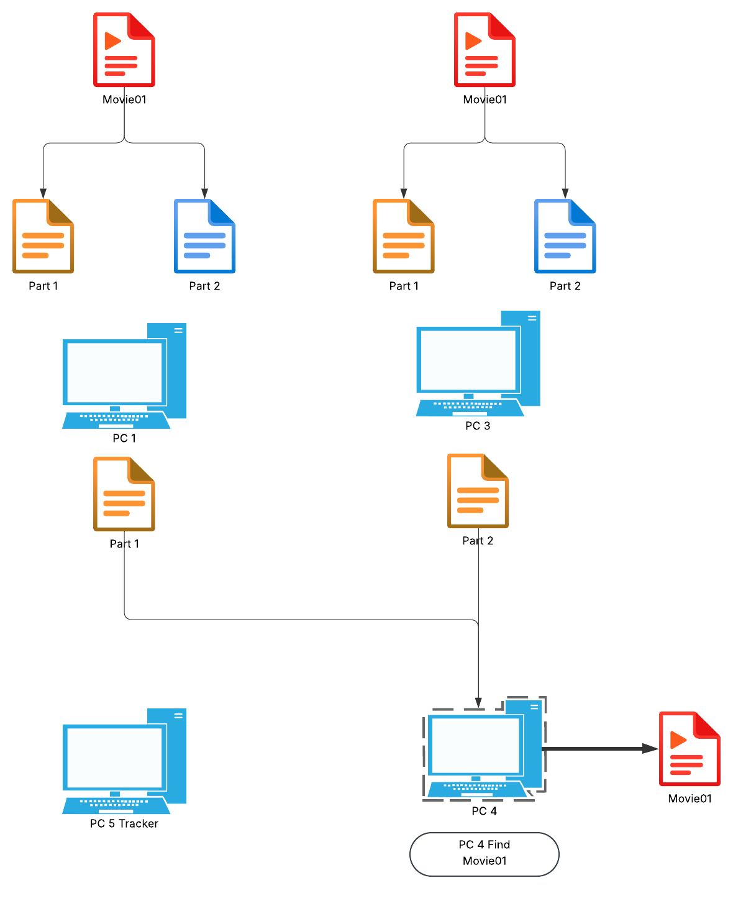

# TorrentSystem
This is a torrent system implemented in C

## Distributed Torrent System in C

This project implements a distributed file transfer system inspired by the **BitTorrent** model, developed entirely in **C** using **TCP sockets** with support for multiple concurrent connections.

# Skills

The system consists of two main programs:
- **`cataloger`**: Acts as the **tracker** and coordinates the network.
- **`catalogerClient.c`**: Acts as a **peer** that can send and receive files directly with other peers.

---

## 🔧 How It Works

1. **Tracker (`cataloger.c`)**
   - Runs first and serves as the central coordination point.
   - When a peer connects:
     1. The peer sends its binary file containing its file list.
     2. The tracker updates the global list and broadcasts it to all connected peers.
   - Using this shared list, each peer knows **which files are available from which peers**, enabling parallel downloads by requesting different file chunks from multiple peers simultaneously.

2. **Peers (`catalogerClient.c`)**
   - Connect to the tracker and receive the global file list.
   - Use the updated binary file to:
     - Identify which peers have the desired files.
     - Split downloads into chunks (parts 1, 2, 3, etc.).
   - Can request different chunks of the same file from multiple peers simultaneously, then reconstruct the complete file locally.
   - Can also send files: when receiving requests, they split files and send only the requested chunk.

---

## 📂 Metadata Binary File

When a peer connects, it sends a binary file containing information about its shared files.  
This file contains for each shared file:

- **Filename** (without full path).
- **Complete file path**.
- **Size in bytes**.
- **Content hash**.
- **IP and port** (included in the filename as reference).

The tracker propagates this updated binary file to all connected peers via broadcast, ensuring everyone has the same current information.

---

## 🔄 Operation Flow

1️⃣ Run `cataloger.c` on the machine that will act as tracker.  
2️⃣ Run `catalogerClient.c` on as many machines as desired peers.  
3️⃣ Each peer selects a directory at startup, recursively scanning all files to generate its metadata binary file.  
4️⃣ When a peer wants to download a file:
   - Consults the binary file to see which peers have it.
   - Launches **concurrent threads** to request different file chunks from different peers.
   - Reconstructs the original file by assembling received chunks.
5️⃣ When a peer sends a file:
   - Splits the file into `n` chunks and sends only the requested portion to each peer.

---

## 📡 Network Communication

- **Protocol**: TCP (sockets).
- **New peer notification**: The tracker broadcasts the updated binary file to all peers when someone connects.
- **File transfer**: Direct P2P between peers, without going through the tracker.

---

## Diagrams

